# Fairness Pipeline Development Toolkit
## Production Enhancement Roadmap

**Strategic Scaling Guide for Small, Medium, and Large Enterprises**

---

## 📋 Executive Summary

This document provides a comprehensive enhancement roadmap to transform the academic Fairness Pipeline Development Toolkit into production-ready systems tailored for different organizational scales. Each tier addresses specific operational constraints, compliance requirements, and technical capabilities.

### Enhancement Philosophy


**Core Principle**: Each tier builds incrementally, maintaining backward compatibility while adding sophistication aligned with organizational maturity.

---

## 🏢 Tier 1: Small Industry Enhancement
**Target**: 10-100 employees, 1-3 ML models, limited DevOps resources

### Strategic Context

**Organizational Profile**:
- Single data science team (2-5 people)
- Cloud infrastructure (AWS/GCP/Azure)
- Basic CI/CD pipeline
- Limited compliance requirements
- Budget: $50K-$200K annually for fairness infrastructure

**Key Constraints**:
- Minimal DevOps support
- No dedicated MLOps team
- Limited monitoring infrastructure
- Cost sensitivity

### Architecture Enhancement


### Critical Enhancements

#### 1. Measurement Module Upgrades

**Automated Scheduling System**
- **Purpose**: Eliminate manual fairness checks
- **Implementation**: Cron-based scheduler or cloud functions
- **Features**:
  - Weekly automatic fairness audits
  - Configurable metric computation schedules
  - Automatic result storage in managed database
  - Email digest of results
- **Infrastructure**: AWS Lambda + EventBridge or GCP Cloud Functions + Scheduler

**Enhanced Statistical Validation**
- **Multi-metric Dashboard**: Single view showing demographic parity, equalized odds, calibration metrics
- **Comparative Analysis**: Automatic comparison against previous week's results
- **Threshold Alerts**: Configurable thresholds trigger email notifications
- **Trend Visualization**: Simple time-series plots in automated reports

**Lightweight Reporting**
- **Format**: HTML email reports (no complex dashboard infrastructure)
- **Content**: 
  - Summary statistics table
  - Top 3 fairness concerns highlighted
  - Week-over-week comparison
  - Embedded charts (static images)
- **Distribution**: Automated email to stakeholders every Monday morning

#### 2. Pipeline Module Enhancements

**Pre-commit Hook Integration**
- **Purpose**: Catch bias issues before code reaches production
- **Implementation**: Git hooks that run bias detection locally
- **Features**:
  - Fast bias checks (<30 seconds)
  - Block commits if critical thresholds exceeded
  - Provide actionable feedback in terminal
- **Configuration**: `.fairness-lint.yml` file in repository

**Simple Web Interface**
- **Technology**: Streamlit or Gradio (no custom frontend development)
- **Features**:
  - Upload dataset → Run bias detection
  - Configure reweighting parameters
  - Download transformed dataset
  - View bias detection report
- **Deployment**: Single container on cloud run service
- **Access Control**: Basic authentication via environment variables

**Data Quality Gates**
- **Integration**: Extend existing CI/CD pipeline
- **Checks**:
  - Minimum sample size per group (n≥30)
  - Missing data patterns analysis
  - Correlation with protected attributes
  - Representation bias detection
- **Action**: Fail pipeline if critical checks fail

#### 3. Training Module Enhancements

**Automated Hyperparameter Tuning**
- **Framework**: Optuna or Ray Tune integration
- **Search Space**: Fairness-accuracy trade-off parameter (eta/lambda)
- **Objective**: Multi-objective optimization (accuracy + fairness metric)
- **Output**: Pareto frontier saved to model registry
- **Budget**: Time-boxed (e.g., 50 trials max)

**Model Registry Integration**
- **Platform**: MLflow Model Registry (already in toolkit)
- **Enhancements**:
  - Automatic fairness metadata tagging
  - Version comparison views (fairness metrics across versions)
  - Staging gates (require fairness threshold pass before promotion)
  - Rollback capability with fairness justification
- **Governance**: Require approval comment citing fairness metrics

**Training Pipeline Templates**
- **Pre-built Configurations**: 5-7 common scenarios
  - Standard classification with demographic parity
  - High-stakes lending with equalized odds
  - Ranking system with exposure parity
  - Regression with MAE parity
- **Format**: YAML templates users can copy and customize
- **Documentation**: Decision tree to help select appropriate template

#### 4. Monitoring Module Enhancements

**Cloud-Native Monitoring**
- **Integration**: AWS CloudWatch, GCP Cloud Monitoring, or Azure Monitor
- **Custom Metrics**: Export fairness metrics as time-series data
- **Dashboards**: Pre-built dashboard templates for each cloud provider
- **Alerts**: Threshold-based alarms routed to email/Slack

**Weekly Automated Reports**
- **Schedule**: Every Sunday night, ready Monday morning
- **Content**:
  - Production model fairness summary
  - Drift detection results
  - Active alerts with severity levels
  - Recommended actions ranked by priority
- **Format**: PDF attached to email + HTML version
- **Storage**: Archived in S3/GCS bucket for compliance

**Simplified Drift Detection**
- **Method**: Kolmogorov-Smirnov test (already implemented)
- **Enhancement**: Compare multiple time windows
  - Last 7 days vs previous 7 days
  - Last 30 days vs reference period
- **Visualization**: Simple line charts showing metric drift over time
- **Actionability**: Each alert includes suggested remediation steps

### Operational Enhancements

#### Documentation System
- **Platform**: GitBook, Notion, or Confluence
- **Content Structure**:
  - Quickstart guide (15 minutes to first metric)
  - Troubleshooting flowcharts
  - Fairness metric selection guide
  - Regulatory compliance checklists (GDPR, CCPA basics)
  - Architecture decision records (ADRs)
- **Maintenance**: Quarterly review and update

#### Training Program
- **Format**: 4-hour workshop (in-person or virtual)
- **Modules**:
  1. Fairness fundamentals (45 min)
  2. Toolkit walkthrough (60 min)
  3. Hands-on exercises (90 min)
  4. Production deployment (45 min)
- **Materials**: Video recordings, Jupyter notebooks, cheat sheets
- **Cadence**: Quarterly for new team members

#### Support Structure
- **Slack Channel**: #fairness-toolkit for questions
- **Office Hours**: Weekly 30-minute Q&A session
- **Runbook**: Common issues and resolutions
- **Escalation**: Designated "fairness champion" for complex issues

### Cost Structure

| Component | Monthly Cost | Annual Cost |
|-----------|-------------|-------------|
| Cloud Infrastructure (compute, storage) | $200-500 | $2,400-6,000 |
| Managed Database (RDS/Cloud SQL) | $100-300 | $1,200-3,600 |
| Monitoring & Alerting | $50-150 | $600-1,800 |
| External Libraries/Tools | $100-200 | $1,200-2,400 |
| Training & Documentation | - | $5,000-10,000 |
| **TOTAL** | **$450-1,150** | **$10,400-23,800** |


### Implementation Timeline (12 Weeks)

#### Phase 1: Foundation (Weeks 1-3)

| Component | Duration | Dependencies | Key Deliverables |
|-----------|----------|--------------|------------------|
| Automated scheduling setup | 2 weeks | None | Cron jobs, scheduled tasks, automation framework |
| Pre-commit hooks implementation | 1 week | None | Git hooks, code quality checks, validation scripts |

#### Phase 2: Integration (Weeks 3-6)

| Component | Duration | Dependencies | Key Deliverables |
|-----------|----------|--------------|------------------|
| Cloud monitoring integration | 2 weeks | Automated scheduling | Cloud platform integration, metric collection |
| Model registry enhancements | 2 weeks | Automated scheduling | Enhanced model versioning, metadata tracking |

#### Phase 3: Interface (Weeks 7-10)

| Component | Duration | Dependencies | Key Deliverables |
|-----------|----------|--------------|------------------|
| Simple web UI development | 2 weeks | Integration complete | User interface, basic visualizations, navigation |
| Automated reporting system | 2 weeks | Cloud monitoring | Report generation, email notifications, dashboards |

#### Phase 4: Operationalization (Weeks 11-12)

| Component | Duration | Dependencies | Key Deliverables |
|-----------|----------|--------------|------------------|
| Documentation completion | 2 weeks | All features complete | User guides, setup instructions, troubleshooting docs |
| Training program delivery | 1 week | Documentation complete | Training sessions, demo materials, Q&A support |
| Production deployment | 1 week | Training complete | Live deployment, monitoring setup, support handoff |

---

#### Critical Path Summary

**Sequential Dependencies:**
1. Foundation → Integration Layer
2. Integration → Interface Development
3. Interface → Operationalization

**Parallel Workstreams:**
- Automated scheduling and pre-commit hooks can be implemented simultaneously
- Cloud monitoring and model registry work can overlap partially
- UI development and reporting system can run in parallel
- Documentation can begin during interface development phase

**Key Milestones:**
- Week 3: Foundation complete, integration begins
- Week 6: Integration ready, interface development starts
- Week 10: All features built, operationalization begins
- Week 12: Production deployment complete

**Total Duration:** 12 weeks (3 months) with streamlined execution

**Comparison to Other Industry Sizes:**
- Large Industry: 18-24 months (comprehensive architecture)
- Medium Industry: 9 months (microservices approach)
- Small Industry: 12 weeks (focused enhancements)

### Success Metrics

**Technical KPIs**:
- ✅ Automated fairness checks run weekly without manual intervention
- ✅ Pre-commit hooks catch 80%+ of bias issues before code review
- ✅ Model registry contains fairness metadata for all production models
- ✅ Monitoring dashboard shows real-time fairness metrics with <5 min latency
- ✅ Alert false positive rate <10%

**Organizational KPIs**:
- ✅ Team spends 70% less time on manual fairness audits
- ✅ 100% of deployed models have documented fairness metrics
- ✅ Time from bias detection to mitigation reduced from weeks to days
- ✅ All team members trained within 90 days of enhancement deployment
- ✅ Zero compliance violations related to bias in 12-month period

---

## 🏭 Tier 2: Medium Industry Enhancement
**Target**: 100-1,000 employees, 10-50 ML models, established MLOps practices

### Strategic Context

**Organizational Profile**:
- Multiple data science teams (3-8 teams)
- Dedicated MLOps/platform team
- Multi-cloud or hybrid infrastructure
- Moderate compliance requirements (GDPR, SOC2, industry-specific)
- Budget: $500K-$2M annually for fairness infrastructure

**Key Drivers**:
- Cross-team standardization
- Regulatory compliance automation
- Audit trail requirements
- Multi-stakeholder governance

### Architecture Enhancement


### Critical Enhancements

#### 1. Platform Architecture

**Microservices Decomposition**
- **Purpose**: Enable independent scaling and team ownership
- **Services**:
  - **Measurement Service**: Metric computation with caching, supports batch and streaming
  - **Pipeline Service**: Manages bias detection and mitigation workflows
  - **Training Service**: Coordinates fair model training experiments
  - **Monitoring Service**: Real-time and batch fairness tracking across all models
  - **Governance Service**: Compliance reporting, audit trails, policy enforcement
- **Communication**: REST APIs + event-driven architecture (Kafka/RabbitMQ)
- **Deployment**: Kubernetes with Helm charts for each service

**API Gateway Layer**
- **Technology**: Kong, AWS API Gateway, or Apigee
- **Features**:
  - Authentication via OAuth2/OIDC (Okta, Auth0)
  - Rate limiting per team/user
  - API versioning (v1, v2 parallel support)
  - Request/response logging
  - API documentation (OpenAPI/Swagger)
- **SLAs**: 99.5% uptime, p99 latency <500ms

**Multi-Tenancy Architecture**
- **Isolation**: Tenant ID in all data models
- **Resource Quotas**: Per-team limits on compute, storage, API calls
- **Custom Configurations**: Team-specific fairness thresholds and policies
- **Billing**: Usage tracking for internal chargeback models

#### 2. Measurement Module Evolution

**Multi-Library Intelligent Routing**
- **Strategy**: Route metric computation to optimal library based on:
  - Data characteristics (size, distribution)
  - Metric type (classification vs regression)
  - Performance requirements (speed vs precision)
- **Libraries**: Fairlearn, AIF360, Aequitas, custom implementations
- **Fallback Logic**: Automatic failover if primary library errors
- **Performance Caching**: Redis-backed cache for repeated metric computations

**Advanced Statistical Framework**
- **Bayesian Confidence Intervals**: In addition to bootstrap, offer Bayesian credible intervals
- **Multiple Comparison Correction**: Automatic Benjamini-Hochberg or Bonferroni
- **Heteroscedasticity Testing**: Detect when variance differs across groups
- **Sensitivity Analysis**: Quantify robustness to threshold changes
- **Intersectional Analysis**: Automatic detection and reporting for 2-3 way intersections

**Metric Catalog & Versioning**
- **Catalog**: Centralized registry of 20+ fairness metrics
- **Metadata**: Each metric includes:
  - Mathematical definition
  - Appropriate use cases
  - Limitations and biases
  - Regulatory relevance (e.g., "GDPR Article 22 compliant")
  - Computational complexity
- **Versioning**: Metric definitions versioned for reproducibility
- **Custom Metrics**: Teams can register custom metrics with governance approval

#### 3. Pipeline Module Evolution

**Workflow Orchestration**
- **Technology**: Apache Airflow or Prefect integration
- **Capabilities**:
  - Multi-step bias mitigation pipelines as DAGs
  - Conditional logic (if bias detected > threshold, then apply mitigation)
  - Parallel execution of independent steps
  - Retry logic with exponential backoff
  - SLA monitoring and alerting
- **Observability**: Each task logs metrics to centralized system

**Advanced Bias Detection**
- **Representation Bias**: 
  - Compare to multiple benchmark datasets
  - Temporal trend analysis (is bias increasing?)
  - Geographic/regional bias detection
- **Label Bias Detection**:
  - Inter-annotator agreement analysis by demographics
  - Historical bias in training labels
  - Proxy label quality assessment
- **Feature Bias Detection**:
  - Mutual information with protected attributes
  - Causal graph analysis (requires domain knowledge input)
  - Emergent proxy detection via correlation clustering

**Transformation Library Expansion**
- **20+ Transformers**:
  - Reweighting: SMOTE, Tomek links, class balancing
  - Preprocessing: Disparate impact remover, learning fair representations
  - In-processing: Prejudice remover, adversarial debiasing
  - Postprocessing: Calibrated equalized odds, reject option classification
- **Composition**: Chain multiple transformers with validation between steps
- **Custom Transformers**: SDK for teams to contribute transformers with review process

**Data Versioning Integration**
- **Technology**: DVC, Pachyderm, or Delta Lake
- **Features**:
  - Track input data versions
  - Track applied transformations
  - Reproduce any historical bias mitigation run
  - Compare transformation effectiveness across versions
- **Lineage**: Full data lineage from raw data to production model

#### 4. Training Module Evolution

**Multi-Framework Support**
- **Frameworks**: Scikit-learn, PyTorch, TensorFlow, XGBoost, LightGBM
- **Unified Interface**: Abstract differences between frameworks
- **Fairness Techniques**:
  - Constraint-based (Fairlearn reductions)
  - Regularization (custom loss functions)
  - Adversarial (gradient reversal layers)
  - Ensemble (multiple models with different fairness-accuracy trade-offs)
- **Automated Selection**: Recommend technique based on model type and fairness requirements

**Experiment Management Platform**
- **Technology**: MLflow with custom plugins or proprietary platform
- **Features**:
  - Fairness-aware hyperparameter tuning (multi-objective optimization)
  - Automated Pareto frontier generation
  - Model comparison dashboard (fairness vs accuracy scatter plots)
  - What-if analysis (predict fairness impact of hyperparameter changes)
  - Experiment templates by use case
- **Collaboration**: Teams can share experiment configurations

**Production-Grade Calibration**
- **Methods**: 
  - Platt scaling
  - Isotonic regression
  - Beta calibration
  - Temperature scaling (neural networks)
- **Group-Specific Calibration**: Separate calibrators per demographic group
- **Validation**: Expected calibration error (ECE) reporting
- **Monitoring**: Calibration drift detection in production

**Fairness-Aware AutoML**
- **Integration**: H2O AutoML, Auto-sklearn, or custom implementation
- **Process**:
  1. Automated feature engineering with bias detection
  2. Model selection considering fairness constraints
  3. Ensemble construction balancing fairness and accuracy
  4. Hyperparameter optimization with fairness objectives
- **Output**: Ranked list of models on Pareto frontier with deployment recommendations

#### 5. Monitoring Module Evolution

**Multi-Model Dashboard**
- **Technology**: Grafana with custom panels or proprietary React dashboard
- **Views**:
  - **Portfolio View**: Fairness status of all production models at a glance
  - **Model Deep-Dive**: Detailed fairness metrics over time for single model
  - **Comparative View**: Side-by-side comparison of 2-3 models
  - **Intersectional View**: Heatmaps of bias across demographic subgroups
- **Interactivity**: Drill-down from high-level alerts to individual predictions
- **Customization**: Teams can create custom views and save configurations

**Advanced Drift Detection**
- **Statistical Tests**:
  - Kolmogorov-Smirnov (distribution shift)
  - Chi-squared (categorical distributions)
  - Maximum Mean Discrepancy (high-dimensional embeddings)
  - Sequential probability ratio test (SPRT) for continuous monitoring
- **Temporal Analysis**:
  - Wavelet decomposition (detect periodic bias patterns)
  - Change point detection (identify exact moment bias changed)
  - Trend analysis (distinguish transient spikes from sustained shifts)
- **Root Cause Analysis**: Automatic investigation of which features contribute to drift

**Alerting & Incident Management**
- **Alert Routing**: Based on model criticality and team ownership
- **Channels**: Email, Slack, PagerDuty, Jira ticket creation
- **Intelligence**:
  - Deduplication (group related alerts)
  - Prioritization scoring (severity × affected user volume)
  - Contextual information (recent deployments, data changes)
- **Feedback Loop**: Close alerts with resolution notes for future reference

**Compliance Reporting Automation**
- **Templates**: Pre-built reports for common regulations
  - GDPR Article 22 (automated decision-making)
  - ECOA (Equal Credit Opportunity Act)
  - Fair Housing Act
  - Industry-specific (e.g., insurance, hiring)
- **Scheduling**: Quarterly, annual, or on-demand report generation
- **Content**:
  - Executive summary
  - Statistical evidence of fairness (or lack thereof)
  - Mitigation actions taken
  - Trend analysis
  - Signed attestations
- **Distribution**: Secure portal for auditors, encrypted email, S3 with access logs

#### 6. Governance Service (New)

**Policy Management**
- **Policy Definition Language**: YAML or custom DSL for fairness policies
- **Example Policies**:
  - "All lending models must maintain demographic parity ratio >0.8"
  - "High-stakes models require monthly fairness audits"
  - "Equalized odds difference must not exceed 0.05 for protected classes"
- **Enforcement**: Policies evaluated at model training, deployment, and monitoring stages
- **Exceptions**: Formal exception request and approval workflow

**Audit Trail**
- **Captured Events**:
  - All fairness metric computations
  - Bias detection runs
  - Mitigation actions applied
  - Model training experiments
  - Policy evaluations and results
  - Manual overrides and justifications
- **Storage**: Immutable append-only log (WORM storage)
- **Searchability**: Full-text search across audit logs
- **Retention**: 7-year retention for compliance

**Role-Based Access Control (RBAC)**
- **Roles**:
  - **Data Scientist**: Run experiments, view results
  - **ML Engineer**: Deploy models, configure monitoring
  - **Fairness Analyst**: Access all data, generate reports
  - **Auditor**: Read-only access to audit trails and reports
  - **Admin**: Manage policies, users, configurations
- **Granularity**: Permissions at model, team, and tenant levels
- **Authentication**: SSO integration (SAML, OIDC)

**Impact Assessment Workflows**
- **Trigger**: Required before deploying new models or major changes
- **Process**:
  1. Automated data collection (stakeholders, use case, demographics)
  2. Risk scoring based on use case criticality
  3. Required fairness thresholds determined
  4. Technical analysis (run full measurement suite)
  5. Human review and sign-off
  6. Documentation generation
- **Output**: Algorithmic Impact Assessment (AIA) document stored in system

### Operational Enhancements

#### Developer Experience

**SDK & Client Libraries**
- **Languages**: Python (primary), R, Java/Scala (for JVM ecosystem)
- **Features**:
  - Idiomatic language conventions
  - Async/await support where applicable
  - Comprehensive error handling
  - Retry logic with exponential backoff
  - Connection pooling
- **Documentation**: Auto-generated API docs, code examples, tutorials

**Command-Line Interface (CLI)**
- **Purpose**: Enable scripting and automation
- **Commands**:
  ```
  fairness measure --model-id abc123 --metric demographic_parity
  fairness detect --dataset data.csv --protected-attr gender
  fairness train --config config.yml --monitor
  fairness report --model-id abc123 --format pdf
  ```
- **Output**: Human-readable by default, JSON with `--json` flag
- **Authentication**: API key or OAuth token via environment variable

**Notebook Extensions**
- **Jupyter Magic Commands**:
  ```
  %fairness_measure model=model, data=X_test, sensitive=gender
  %fairness_monitor model_id="abc123" window="7d"
  ```
- **Interactive Widgets**: IPython widgets for parameter configuration
- **Automatic Tracking**: Capture fairness metrics from notebook runs to platform

#### Education & Enablement

**Certification Program**
- **Levels**:
  - **Practitioner**: Basic usage, 4-hour course + quiz
  - **Specialist**: Advanced techniques, 2-day workshop + project
  - **Expert**: Platform administration, 1-week intensive + exam
- **Content**: Video lectures, hands-on labs, case studies
- **Credential**: Digital badge displayed in internal profiles

**Best Practices Library**
- **Content**: 50+ documented patterns
  - When to use demographic parity vs equalized odds
  - Handling intersectional fairness
  - Selecting appropriate mitigation techniques
  - Communicating fairness trade-offs to stakeholders
  - Regulatory compliance checklists
- **Format**: Searchable wiki with examples and anti-patterns
- **Maintenance**: Quarterly review by fairness working group

**Community of Practice**
- **Structure**: Cross-team working group meeting monthly
- **Activities**:
  - Case study presentations
  - Troubleshooting sessions
  - Feature prioritization
  - Standards development
- **Communication**: Dedicated Slack workspace, quarterly newsletter

#### Platform Operations

**SRE & Reliability**
- **Monitoring**: Full observability stack (Prometheus, Grafana, Jaeger)
- **SLIs/SLOs**:
  - API availability: 99.5%
  - API latency (p99): <500ms
  - Metric computation time (p95): <2 minutes
  - Dashboard load time: <3 seconds
- **Incident Management**: On-call rotation, runbooks, post-incident reviews
- **Capacity Planning**: Quarterly forecasting based on model growth

**Security & Compliance**
- **Data Encryption**: At rest (AES-256) and in transit (TLS 1.3)
- **Vulnerability Scanning**: Weekly scans, critical patches within 48 hours
- **Penetration Testing**: Annual third-party testing
- **Compliance Certifications**: SOC2 Type II, ISO 27001
- **Data Residency**: Support for regional data storage requirements (GDPR)

**Cost Management**
- **Resource Tagging**: Tag all cloud resources by team, project, environment
- **Budget Alerts**: Automated notifications when spending exceeds thresholds
- **Cost Attribution**: Detailed breakdown of costs by team for chargeback
- **Optimization**: Quarterly reviews to identify cost reduction opportunities

### Cost Structure

| Component | Monthly Cost | Annual Cost |
|-----------|-------------|-------------|
| Cloud Infrastructure (multi-region) | $10K-25K | $120K-300K |
| Database Systems (OLTP + OLAP) | $5K-15K | $60K-180K |
| Kubernetes Cluster Management | $3K-8K | $36K-96K |
| Monitoring & Logging | $2K-5K | $24K-60K |
| API Gateway & Security | $1K-3K | $12K-36K |
| External Services (Auth, Secrets) | $1K-2K | $12K-24K |
| Personnel (2-3 FTE platform team) | $40K-60K | $480K-720K |
| Training & Enablement | - | $50K-100K |
| **TOTAL** | **$62K-118K** | **$794K-1,516K** |

# Implementation Timeline (9 Months)

## Phase 1: Foundation (Months 1-2)

| Component | Duration | Dependencies | Key Deliverables |
|-----------|----------|--------------|------------------|
| Microservices architecture design | 4 weeks | None | Architecture blueprints, service boundaries, tech stack |
| API gateway setup | 2 weeks | Architecture design | API gateway configuration, routing rules |
| Database infrastructure | 3 weeks | Architecture design | Database setup, schema design, data models |

## Phase 2: Core Services (Months 2-4)

| Component | Duration | Dependencies | Key Deliverables |
|-----------|----------|--------------|------------------|
| Measurement service development | 6 weeks | Database infrastructure | Bias measurement APIs, metric calculations |
| Pipeline service development | 6 weeks | Database infrastructure | Data pipeline orchestration, ETL workflows |
| Training service development | 6 weeks | Database infrastructure, Measurement service | Model training workflows, version control |
| Monitoring service development | 6 weeks | Database infrastructure, Measurement service | Real-time monitoring, alerting system |

## Phase 3: Governance (Months 4-6)

| Component | Duration | Dependencies | Key Deliverables |
|-----------|----------|--------------|------------------|
| Governance service development | 8 weeks | Core services | Policy engine, compliance checks, approval workflows |
| RBAC implementation | 4 weeks | Governance service | Role-based access control, permissions management |
| Audit trail system | 3 weeks | Governance service | Activity logging, audit reports, compliance tracking |

## Phase 4: Integration (Months 6-7)

| Component | Duration | Dependencies | Key Deliverables |
|-----------|----------|--------------|------------------|
| MLflow integration | 3 weeks | Training service | Model registry integration, experiment tracking |
| Airflow integration | 3 weeks | Pipeline service | Workflow orchestration, scheduling |
| SDK development | 4 weeks | All core services | Python SDK, API clients, code samples |

## Phase 5: Operationalization (Months 7-9)

| Component | Duration | Dependencies | Key Deliverables |
|-----------|----------|--------------|------------------|
| Dashboard development | 6 weeks | All services integrated | Executive dashboards, team dashboards, reports |
| Documentation & training | 4 weeks | SDK, Dashboards | User guides, API docs, training materials |
| Pilot deployment (2 teams) | 4 weeks | Documentation complete | Pilot feedback, use cases, success metrics |
| Full rollout | 2 weeks | Successful pilots | Organization-wide deployment, support plan |

---

## Critical Path Summary

**Sequential Dependencies:**
1. Architecture Design → Infrastructure Setup
2. Infrastructure → Core Services
3. Core Services → Governance Layer
4. Governance → Integrations
5. Integrations → Operationalization

**Parallel Workstreams:**
- Measurement and Pipeline services can be developed simultaneously
- Training and Monitoring services can run in parallel
- MLflow and Airflow integrations can overlap
- Dashboard development can begin while documentation is being created

**Key Milestones:**
- Month 2: Foundation complete, core services begin
- Month 4: Core services ready, governance development starts
- Month 6: Governance complete, integration phase begins
- Month 7: All integrations ready, operationalization begins
- Month 9: Full rollout complete

**Total Duration:** 9 months with accelerated timeline through parallel execution

### Success Metrics

**Technical KPIs**:
- ✅ Platform processes 1,000+ fairness metric computations daily
- ✅ API availability consistently >99.5%
- ✅ 90% of models onboarded to monitoring within 30 days of deployment
- ✅ Automated compliance reports generated for 100% of high-stakes models
- ✅ Audit trail captures 100% of fairness-related actions with zero data loss

**Organizational KPIs**:
- ✅ 80%+ of data scientists certified at Practitioner level within 6 months
- ✅ Cross-team fairness metric standardization achieved (single definition per metric)
- ✅ Regulatory audit preparation time reduced by 60%
- ✅ Bias-related production incidents reduced by 75%
- ✅ Platform adoption across 8+ teams within 12 months

---

## 🌐 Tier 3: Large Industry Enhancement
**Target**: 1,000+ employees, 100+ ML models, global operations, stringent compliance

### Strategic Context

**Organizational Profile**:
- 10-30+ data science teams across multiple business units
- Global presence with regional regulations (GDPR, CCPA, LGPD, etc.)
- Enterprise MLOps platform with dedicated teams
- High-stakes applications (finance, healthcare, legal, hiring)
- Budget: $5M-$20M+ annually for fairness infrastructure

**Key Drivers**:
- Regulatory compliance at scale
- Enterprise-grade reliability (99.9%+ uptime)
- Global data sovereignty requirements
- Advanced R&D on fairness techniques
- Executive-level reporting and governance

### Architecture Enhancement


### Critical Enhancements

#### 1. Global Platform Architecture

**Multi-Region Active-Active Deployment**
- **Purpose**: Low latency globally, data residency compliance, high availability
- **Topology**:
  - Primary regions: US-East, EU-West, APAC-Southeast
  - Disaster recovery regions: US-West, EU-North
  - Edge locations: 15+ CDN PoPs
- **Data Replication**: 
  - Asynchronous cross-region replication for non-sensitive data
  - Region-specific storage for sensitive data (no cross-border transfer)
  - Metadata synchronized globally with conflict resolution
- **Traffic Management**: GeoDNS with health checks and automatic failover

**Data Sovereignty & Compliance**
- **Regional Isolation**: EU data never leaves EU infrastructure
- **Data Classification**: Automatic tagging (PII, sensitive, public)
- **Cross-Border Workflows**: Explicit approval required for any cross-border data movement
- **Compliance Automation**: Regional policy enforcement (GDPR right-to-forget, CCPA opt-out)
- **Audit Trail**: Immutable logs stored in region of origin with blockchain anchoring

**Enterprise Integration Fabric**
- **Integration Patterns**:
  - REST APIs for synchronous operations
  - Event streaming (Kafka) for asynchronous workflows
  - GraphQL for flexible data queries
  - gRPC for high-performance service-to-service communication
- **Connectors**: Pre-built integrations to 20+ enterprise systems
  - Data sources: SAP, Oracle, Salesforce, Workday
  - ML platforms: Databricks, SageMaker, Vertex AI, Azure ML
  - BI tools: Tableau, Power BI, Looker
  - ITSM: ServiceNow, Jira
- **Data Federation**: Query across systems without data movement (Presto/Trino)

#### 2. Advanced Intelligence Layer

**ML for Fairness (Meta-Learning)**
- **Fairness Prediction Models**: Predict fairness metrics before full evaluation
  - Train on historical model + dataset characteristics
  - Use for early-stage screening of model candidates
  - 90%+ accuracy in predicting whether model meets fairness thresholds
- **Automated Bias Detection**: ML models that identify bias patterns
  - Anomaly detection in fairness metric time-series
  - Clustering to find similar historical bias incidents
  - NLP on model documentation to identify risk factors
- **Recommendation System**: Suggest mitigation techniques
  - Based on model type, data characteristics, fairness violation pattern
  - Learn from effectiveness of past mitigation actions
  - Personalized recommendations by team/use case

**Explainability Integration**
- **Global Explainability**: Which features contribute most to fairness violations?
  - Feature importance analysis with fairness-aware metrics
  - Partial dependence plots segmented by demographic groups
  - Counterfactual analysis (what changes would improve fairness?)
- **Local Explainability**: Why did this individual prediction show bias?
  - SHAP/LIME integration for individual predictions
  - Fairness-specific explanations (e.g., "prediction differs from similar people in other demographic group by X%")
  - Interactive visualization of explanation
- **Model Cards Extension**: Auto-generated fairness sections
  - Intended use and limitations with fairness lens
  - Fairness metrics across subpopulations
  - Mitigation techniques applied
  - Known limitations and residual bias

**Causal Fairness Analysis**
- **Purpose**: Distinguish correlation from causation in fairness analysis
- **Techniques**:
  - Causal graph inference (learn relationships between features)
  - Counterfactual fairness (would prediction change if protected attribute changed?)
  - Path-specific fairness (decompose bias through causal pathways)
  - Mediation analysis (how much bias flows through specific features?)
- **Integration**: DoWhy, CausalML libraries wrapped with fairness-specific workflows
- **Use Cases**: High-stakes decisions where causal understanding is critical (hiring, lending, healthcare)

**Simulation & What-If Analysis Engine**
- **Scenario Modeling**:
  - "What if we change the fairness threshold from 0.8 to 0.9?"
  - "What if demographic distribution shifts by 10%?"
  - "What impact would new regulation have on our models?"
- **Impact Forecasting**: Predict long-term fairness trends
  - Based on historical data drift patterns
  - Incorporating anticipated business changes
  - Monte Carlo simulation for uncertainty quantification
- **Cost-Benefit Analysis**: Quantify fairness-accuracy trade-offs in business terms
  - Translate fairness metrics to user impact
  - Estimate financial implications of different fairness strategies
  - Support executive decision-making with data

#### 3. Enterprise Governance Framework

**Policy-as-Code Engine**
- **Technology**: Open Policy Agent (OPA) integrated into platform
- **Policy Types**:
  - **Compliance Policies**: Encode regulations (GDPR Article 22, ECOA, Fair Housing Act)
  - **Business Policies**: Internal standards (e.g., "consumer-facing models require monthly audits")
  - **Technical Policies**: Engineering requirements (e.g., "all models must log fairness metrics")
- **Enforcement Points**: Evaluated at data ingestion, model training, deployment, monitoring
- **Policy Testing**: Test policies against historical scenarios before deployment
- **Version Control**: Policies stored in Git with review process

**Risk Management System**
- **Risk Scoring**: Automated risk assessment for every model
  - Factors: Use case criticality, affected population size, historical bias incidents, regulatory environment
  - Output: Risk score (1-100) with breakdown by factor
  - Threshold-based workflow routing (high-risk → manual review)
- **Risk Register**: Central repository of identified risks
  - Risk description, likelihood, impact, mitigation plan
  - Owner assignment and due dates
  - Status tracking and escalation
- **Risk Mitigation Tracking**: Monitor effectiveness of mitigation actions
  - Before/after fairness metrics
  - Time to resolution
  - Cost of mitigation
  - Lessons learned

**Blockchain-Backed Audit Trail**
- **Purpose**: Tamper-proof evidence for regulatory audits
- **Implementation**: 
  - Write critical events to distributed ledger (Hyperledger Fabric or private Ethereum)
  - Store detailed data in traditional database
  - Hash stored on blockchain for integrity verification
- **Anchored Events**:
  - Policy deployments and changes
  - High-stakes model deployments
  - Fairness threshold violations and resolutions
  - Manual overrides and justifications
  - Audit report generations
- **Verification**: Auditors can cryptographically verify event authenticity

**Executive Reporting & Dashboards**
- **Audience-Specific Views**:
  - **CEO/Board**: High-level fairness posture, regulatory compliance status, key risks
  - **Chief Risk Officer**: Detailed risk breakdown, incident trends, mitigation effectiveness
  - **CISO**: Security aspects, data protection, access controls
  - **Business Unit Leaders**: Fairness metrics for their models, comparison to benchmarks
- **Key Metrics**:
  - Percentage of models meeting fairness thresholds
  - Open fairness incidents by severity
  - Compliance status by regulation and region
  - Fairness trend over time (improving/degrading)
  - Cost of fairness interventions
- **Delivery**: Interactive dashboards + automated email reports + API access

#### 4. Research & Innovation Hub

**Fairness Research Lab**
- **Purpose**: Advance state-of-the-art fairness techniques for enterprise use
- **Activities**:
  - Evaluate cutting-edge academic research for production readiness
  - Develop custom fairness algorithms for unique business needs
  - Collaborate with universities on research projects
  - Publish whitepapers and conference papers
- **Infrastructure**: Dedicated GPU clusters for experimentation
- **Output**: New techniques promoted to production platform after validation

**Experimentation Framework**
- **A/B Testing at Scale**: Run fairness experiments across millions of users
  - Multi-armed bandit algorithms for efficient exploration
  - Segmented experiments (test different approaches for different demographics)
  - Automated stopping rules (declare winner when statistical significance reached)
- **Shadow Mode**: Deploy new fairness techniques in shadow mode
  - Compute fairness metrics without affecting production
  - Compare to current production approach
  - De-risk before full deployment
- **Feature Flags**: Gradual rollout of new fairness features
  - Enable for specific teams or models first
  - Monitor for issues and roll back if needed
  - Controlled expansion to broader usage

**Synthetic Data Generation**
- **Purpose**: Create realistic datasets for fairness testing without privacy concerns
- **Techniques**:
  - Generative Adversarial Networks (GANs)
  - Variational Autoencoders (VAEs)
  - Differential privacy-preserving synthesis (DP-CTGAN)
- **Validation**: Ensure synthetic data preserves fairness properties of real data
- **Use Cases**:
  - Training data augmentation (increase representation of minority groups)
  - Testing fairness interventions safely
  - Sharing data with external partners/auditors
  - Regulatory sandbox environments

#### 5. Advanced Monitoring & Observability

**Real-Time Streaming Analytics**
- **Technology**: Apache Flink or Spark Streaming
- **Capabilities**:
  - Process millions of predictions per second
  - Compute fairness metrics on sliding windows (1 min, 5 min, 1 hour, 1 day)
  - Detect anomalies in real-time (sudden spikes in bias)
  - Trigger immediate alerts for critical violations
- **Integration**: Kafka topics for prediction data, metrics written to TimescaleDB

**Distributed Tracing**
- **Purpose**: Understand fairness pipeline performance and debug issues
- **Technology**: OpenTelemetry with Jaeger or Zipkin
- **Traces**: Full request path from API call → metric computation → database write
- **Correlation**: Link traces to business context (model ID, team, experiment)
- **Analysis**: Identify bottlenecks, optimize slow fairness computations

**Proactive Monitoring**
- **Predictive Alerting**: ML models that predict fairness violations before they occur
  - Train on patterns preceding historical violations
  - Alert 24-48 hours before predicted violation
  - Provide recommended preventive actions
- **Anomaly Detection**: Statistical and ML-based anomaly detection
  - Isolation Forest, Autoencoders for multivariate anomaly detection
  - Seasonal decomposition for trend vs anomaly separation
  - Context-aware thresholds (different for weekday vs weekend)
- **Intelligent Alert Routing**: Route alerts to appropriate teams automatically
  - Based on model ownership metadata
  - Escalation if not acknowledged within SLA
  - Integration with on-call systems (PagerDuty, Opsgenie)

**Comprehensive Observability**
- **Golden Signals for Fairness**:
  - **Latency**: Time to compute fairness metrics
  - **Traffic**: Number of models monitored, predictions processed
  - **Errors**: Failed fairness computations, data quality issues
  - **Saturation**: Resource utilization (CPU, memory, database connections)
  - **Fairness**: Actual fairness metrics as a "signal" themselves
- **Dashboards**: Grafana dashboards for each service + unified fairness overview
- **Logging**: Structured logs (JSON) with trace IDs, searchable via ELK or Splunk
- **SLOs**: Track against service level objectives with error budget tracking

#### 6. Developer Productivity Tools

**IDE Integrations**
- **VS Code Extension**: Fairness checks integrated into IDE
  - Inline warnings if code patterns associated with bias detected
  - Autocomplete for fairness metrics and configurations
  - Quick actions (e.g., "Add fairness logging to this model")
- **Jupyter Lab Extension**: Enhanced notebook experience
  - Fairness widget for interactive metric exploration
  - Automatic visualization generation
  - One-click export to platform for monitoring

**Fairness Testing Framework**
- **Property-Based Testing**: Automatically generate test cases for fairness properties
  - "Model predictions should not vary by >X% when only changing protected attribute"
  - Generate thousands of test cases with Hypothesis library
  - Identify edge cases where fairness breaks down
- **Regression Testing**: Ensure fairness doesn't degrade over time
  - Baseline fairness metrics stored for each model version
  - CI/CD fails if new version is significantly less fair
  - Visual diff of fairness metrics between versions

**Collaborative Development**
- **Code Review Checklists**: Automated fairness checklist in pull requests
  - "Did you document protected attributes?"
  - "Have you measured fairness on holdout set?"
  - "Is there a plan for production monitoring?"
- **Pair Programming Guides**: Best practices for fairness in code reviews
- **Knowledge Sharing**: Internal fairness knowledge base
  - Searchable repository of solved problems
  - Pattern library (common issues and solutions)
  - Expert directory (who to ask for different fairness topics)

### Operational Enhancements

#### Organizational Structure

**Dedicated Fairness Center of Excellence**
- **Team Composition** (15-25 people):
  - **Platform Engineers** (5-7): Build and maintain fairness infrastructure
  - **Data Scientists** (3-5): Develop fairness algorithms and research
  - **ML Engineers** (3-4): Integrate fairness into ML pipelines
  - **Compliance Specialists** (2-3): Ensure regulatory adherence
  - **Product Manager** (1): Roadmap and prioritization
  - **Technical Program Manager** (1): Cross-team coordination
  - **SRE** (2): Platform reliability and operations
- **Charter**: Set fairness standards, provide tooling, advise teams, conduct audits
- **Reporting**: Reports to CTO/CIO with dotted line to Chief Risk Officer

**Fairness Champions Network**
- **Structure**: 1-2 designated fairness champions per data science team
- **Responsibilities**:
  - Advocate for fairness within team
  - First point of contact for fairness questions
  - Attend monthly champions meeting
  - Provide feedback on platform roadmap
- **Support**: Additional training, direct access to fairness CoE experts

#### Advanced Training & Certification

**Role-Based Learning Paths**
- **Data Scientist Track**: Focus on fairness metrics, mitigation techniques
- **ML Engineer Track**: Focus on integration, monitoring, deployment
- **Product Manager Track**: Focus on trade-offs, stakeholder communication, regulations
- **Executive Track**: Focus on business impact, regulatory landscape, risk management
- **Legal/Compliance Track**: Focus on regulatory requirements, audit processes

**Hands-On Workshops**
- **Bias Debugging Workshop**: Investigate and fix bias in realistic scenarios
- **Regulatory Compliance Workshop**: Navigate GDPR, ECOA, etc. requirements
- **Stakeholder Communication Workshop**: Explain fairness concepts to non-technical audiences
- **Advanced Topics**: Causal fairness, intersectionality, adversarial debiasing

**Continuous Learning**
- **Lunch & Learns**: Monthly sessions on new techniques, case studies
- **Guest Speakers**: External experts from academia, industry, advocacy groups
- **Conference Attendance**: Sponsor attendance at FAccT, NeurIPS fairness workshops
- **Internal Conference**: Annual internal fairness conference showcasing work across company

#### Change Management

**Stakeholder Engagement Strategy**
- **Executive Sponsorship**: Secure visible C-level champion
- **Regular Communication**: Monthly newsletter to all stakeholders
- **Success Stories**: Highlight wins and impact
- **Feedback Channels**: Multiple ways to provide input (surveys, office hours, forums)

**Adoption Roadmap**
- **Phase 1: Early Adopters**: Partner with 2-3 willing teams, iterate based on feedback
- **Phase 2: Mandatory Pilots**: Require 5 high-stakes models to onboard
- **Phase 3: Broad Rollout**: Make available to all teams, provide support
- **Phase 4: Mandatory Compliance**: Require all models to use platform within 18 months
- **Phase 5: Optimization**: Refine based on learnings, scale globally

**Incentive Alignment**
- **Performance Reviews**: Include fairness metrics in data scientist evaluations
- **Promotion Criteria**: Demonstrate fairness expertise for senior roles
- **Team KPIs**: Include fairness compliance in team objectives
- **Recognition**: Awards for exceptional fairness contributions

### Cost Structure

| Component | Monthly Cost | Annual Cost |
|-----------|-------------|-------------|
| Cloud Infrastructure (global, multi-region) | $100K-300K | $1.2M-3.6M |
| Database & Data Platform (enterprise-scale) | $50K-150K | $600K-1.8M |
| Kubernetes & Orchestration (multi-cluster) | $20K-60K | $240K-720K |
| Monitoring, Logging, Security (enterprise) | $30K-80K | $360K-960K |
| API Gateway, CDN, Networking | $15K-40K | $180K-480K |
| External Services & Licenses | $10K-30K | $120K-360K |
| Personnel (20-30 FTE total) | $400K-800K | $4.8M-9.6M |
| Training & Change Management | - | $500K-1M |
| External Consulting & Audits | - | $200K-500K |
| Research & Innovation | - | $300K-800K |
| **TOTAL** | **$625K-1,460K** | **$8.5M-20.26M** |

### Implementation Timeline (18-24 Months)

#### Phase 1: Foundation (Months 1-6)

| Component | Duration | Dependencies | Key Deliverables |
|-----------|----------|--------------|------------------|
| Global architecture design | 8 weeks | None | Architecture blueprints, technology stack decisions |
| Multi-region infrastructure | 12 weeks | Architecture design | Cloud infrastructure across all regions |
| Data platform & federation | 10 weeks | Architecture design | Unified data layer, federation framework |
| Enterprise integrations | 8 weeks | Architecture design | Integration with existing enterprise systems |

#### Phase 2: Core Platform (Months 7-12)

| Component | Duration | Dependencies | Key Deliverables |
|-----------|----------|--------------|------------------|
| Measurement & pipeline services | 12 weeks | Data platform | Automated measurement pipelines, data quality checks |
| Training & monitoring services | 12 weeks | Data platform | Model training infrastructure, monitoring dashboards |
| Governance & audit systems | 14 weeks | Data platform, Infrastructure | Compliance framework, audit trails, access controls |
| Intelligence layer (ML for fairness) | 10 weeks | Measurement services | ML models for bias detection, fairness metrics |

#### Phase 3: Advanced Features (Months 13-16)

| Component | Duration | Dependencies | Key Deliverables |
|-----------|----------|--------------|------------------|
| Causal analysis integration | 8 weeks | Core platform | Causal inference tools, experimentation framework |
| Real-time streaming analytics | 8 weeks | Core platform | Real-time monitoring, streaming data pipelines |
| Executive dashboards | 6 weeks | Core platform, Intelligence layer | Executive reporting, KPI dashboards |
| Research lab setup | 6 weeks | Core platform | Research environment, experimentation tools |

#### Phase 4: Operationalization (Months 17-22)

| Component | Duration | Dependencies | Key Deliverables |
|-----------|----------|--------------|------------------|
| SDK & developer tools | 10 weeks | Core platform complete | SDKs, CLI tools, documentation |
| Training program (all tracks) | 12 weeks | SDK & tools | Training materials, certification programs |
| Change management execution | 16 weeks | Training program | Communication plans, stakeholder engagement |
| Early adopter pilots (3 teams) | 12 weeks | SDK, Training | Pilot results, feedback, case studies |

#### Phase 5: Scale & Optimize (Months 23-24+)

| Component | Duration | Dependencies | Key Deliverables |
|-----------|----------|--------------|------------------|
| Broad rollout (10+ teams) | 12 weeks | Successful pilots | Organization-wide deployment |
| Global expansion (all regions) | 8 weeks | Broad rollout | Full regional coverage |
| Optimization & refinement | 12 weeks (ongoing) | Global expansion | Performance improvements, feature enhancements |

---

## Critical Path Summary

**Sequential Dependencies:**
1. Architecture Design → Infrastructure & Data Platform
2. Data Platform → Core Platform Services
3. Core Platform → Advanced Features
4. Advanced Features → Operationalization
5. Operationalization → Scale & Optimize

**Parallel Workstreams:**
- Infrastructure setup can run parallel with data platform development
- Multiple core services can be developed simultaneously
- Training and change management can overlap with SDK development
- Pilots can begin while change management continues

**Total Duration:** 18-24 months with potential for optimization through parallel execution

### Success Metrics

**Technical KPIs**:
- ✅ Platform processes 100,000+ fairness metric computations daily across all regions
- ✅ 99.9% API availability with <100ms p99 latency globally
- ✅ 100% of production models (100+) monitored in real-time
- ✅ Zero data sovereignty violations across all regions
- ✅ Automated compliance reports generated for 100% of models in regulated domains
- ✅ Audit trail captures 100% of fairness actions with cryptographic verification

**Organizational KPIs**:
- ✅ 100% of data scientists certified at Practitioner level
- ✅ 50%+ of data scientists certified at Specialist level
- ✅ All high-stakes models undergo formal fairness impact assessment
- ✅ Regulatory audit preparation time reduced by 80%
- ✅ Zero regulatory fines or violations related to algorithmic bias
- ✅ Fairness-related production incidents reduced by 90%
- ✅ Executive dashboard used weekly by C-suite for decision-making

**Business KPIs**:
- ✅ Quantified risk reduction ($X million in potential liability avoided)
- ✅ Competitive advantage in regulated markets due to robust fairness practices
- ✅ Improved brand reputation (measured via customer surveys, media sentiment)
- ✅ Increased trust from regulators enabling faster product approvals
- ✅ Platform becomes industry standard, licensed to external customers

---

## 🔄 Cross-Tier Comparison

### Feature Matrix

| Capability | Small Industry | Medium Industry | Large Industry |
|-----------|---------------|----------------|----------------|
| **Architecture** | Monolithic with cloud services | Microservices on Kubernetes | Global multi-region active-active |
| **Fairness Metrics** | 5-10 core metrics | 20+ metrics with custom support | 50+ metrics + research lab for new techniques |
| **Statistical Rigor** | Bootstrap CI | Bootstrap CI + Bayesian + corrections | Full Bayesian inference + causal analysis |
| **Integrations** | MLflow, basic CI/CD | MLflow, Airflow, 5+ tools | 20+ enterprise systems, full ERP integration |
| **Monitoring** | Weekly reports | Real-time dashboards | Real-time streaming + predictive alerts |
| **Governance** | Basic audit logging | RBAC + policy engine | Blockchain audit + global compliance framework |
| **Team Support** | Email + Slack | SDK, CLI, dedicated support | IDE extensions, 24/7 support, CoE |
| **Compliance** | GDPR/CCPA basics | SOC2, ISO 27001 | Full regulatory framework, external audits |
| **Cost** | $10K-24K/year | $800K-1.5M/year | $8M-20M/year |
| **Team Size** | Toolkit users only | 2-3 FTE platform team | 20-30 FTE fairness organization |

### Decision Framework

```mermaid
graph TD
    Start[Assess Organization] --> Models{How many<br/>ML models?}
    
    Models -->|1-3| Small[Small Industry Tier]
    Models -->|10-50| CheckTeams{Multiple<br/>independent<br/>teams?}
    Models -->|100+| Large[Large Industry Tier]
    
    CheckTeams -->|No| Small
    CheckTeams -->|Yes| CheckCompliance{Stringent<br/>compliance<br/>needs?}
    
    CheckCompliance -->|Moderate| Medium[Medium Industry Tier]
    CheckCompliance -->|High| Large
    
    Small --> SmallFeatures[• Email alerts<br/>• Pre-commit hooks<br/>• Streamlit UI<br/>• Weekly reports]
    Medium --> MediumFeatures[• Microservices<br/>• API Gateway<br/>• Governance service<br/>• Real-time dashboards]
    Large --> LargeFeatures[• Global deployment<br/>• Causal analysis<br/>• Research lab<br/>• Blockchain audit]
    
    style Small fill:#3498db,stroke:#2980b9,color:#fff
    style Medium fill:#e67e22,stroke:#d35400,color:#fff
    style Large fill:#8e44ad,stroke:#71368a,color:#fff
```



### Migration Paths


---

## 📊 Industry-Specific Considerations

### Financial Services

**Unique Requirements**:
- Fair lending laws (ECOA, FCRA)
- Model Risk Management (SR 11-7)
- Explainability for credit decisions
- Adverse action notices

**Enhancements**:
- Pre-built regulatory report templates
- Credit score fairness metrics (disparate impact ratios)
- Automated adverse action reason code generation
- Integration with credit bureau data validation

### Healthcare

**Unique Requirements**:
- HIPAA compliance
- Clinical validation requirements
- Health equity focus (social determinants of health)
- FDA approval pathways for AI/ML medical devices

**Enhancements**:
- Clinical fairness metrics (treatment outcome parity)
- Health disparity analysis across social determinants
- Integration with electronic health record (EHR) systems
- Clinical trial diversity analysis

### Hiring & HR

**Unique Requirements**:
- EEOC compliance (Title VII)
- OFCCP regulations (affirmative action)
- ADA accommodations
- Pay equity analysis

**Enhancements**:
- Four-fifths rule automated checking
- Adverse impact analysis by protected class
- Intersectional hiring funnel analysis
- Pay equity regression modeling with fairness constraints

### Insurance

**Unique Requirements**:
- Actuarial fairness
- Prohibited discriminatory factors (varies by state)
- Rate filing requirements
- Loss ratio requirements

**Enhancements**:
- Actuarial fairness metrics (risk-aligned pricing)
- Geographic fairness analysis
- Rate impact simulation by demographic group
- Integration with actuarial modeling platforms

---

## 🎯 Critical Success Factors

### 1. Executive Sponsorship
- **Why**: Fairness requires investment, trade-offs, and cultural change
- **How**: Secure visible C-level champion, tie to company values
- **Measure**: Executive engagement in fairness reviews, budget allocation

### 2. Regulatory Alignment
- **Why**: Avoid costly fines, enable business growth
- **How**: Proactive engagement with regulators, stay ahead of legislation
- **Measure**: Zero violations, positive regulatory relationships

### 3. Technical Excellence
- **Why**: Platform must be reliable, accurate, and performant
- **How**: Strong engineering practices, comprehensive testing, SRE principles
- **Measure**: Uptime, latency, accuracy of fairness measurements

### 4. User Adoption
- **Why**: Platform value is only realized if teams use it
- **How**: Excellent UX, training, support, demonstrate value
- **Measure**: Active users, models onboarded, user satisfaction scores

### 5. Continuous Improvement
- **Why**: Fairness science and regulations evolve rapidly
- **How**: Research investment, community engagement, feedback loops
- **Measure**: New techniques adopted, platform evolution pace

---

## 🚀 Getting Started

### Tier Assessment Worksheet

**Answer these questions to determine your appropriate tier:**

1. **How many production ML models do you have?**
   - 1-5: Likely Small
   - 6-50: Likely Medium
   - 50+: Likely Large

2. **How many independent data science teams?**
   - 1: Small
   - 2-5: Medium
   - 6+: Large

3. **What's your regulatory environment?**
   - Basic (GDPR/CCPA): Small
   - Moderate (+ industry-specific): Medium
   - Stringent (multiple regulations + audits): Large

4. **What's your annual ML infrastructure budget?**
   - <$100K: Small
   - $100K-$2M: Medium
   - $2M+: Large

5. **Do you have dedicated MLOps/platform teams?**
   - No: Small
   - 1-2 people: Medium
   - 5+ people: Large

**Scoring**: If 3+ answers point to one tier, start there. If mixed, choose the higher tier.

### Next Steps by Tier

**Small Industry**:
1. Review current toolkit demo
2. Identify 1-2 critical models for pilot
3. Allocate 1 engineer for 3 months to implement enhancements
4. Schedule quarterly fairness reviews

**Medium Industry**:
1. Form fairness working group (representatives from each team)
2. Conduct architecture review and tool evaluation
3. Allocate 2-3 engineers for 6-9 months
4. Plan phased rollout across teams

**Large Industry**:
1. Business case development for executive approval
2. Hire or designate fairness CoE lead
3. RFP process for implementation partner (if needed)
4. 18-24 month roadmap development
5. Pilot with 2-3 critical business units

---

## 📚 Additional Resources

### Standards & Frameworks
- **ISO/IEC 42001**: AI Management System
- **NIST AI Risk Management Framework**
- **IEEE 7000 Series**: Ethics in AI standards
- **EU AI Act**: Compliance requirements

### Academic Resources
- **ACM Conference on Fairness, Accountability, and Transparency (FAccT)**
- **NeurIPS Workshop on Algorithmic Fairness**
- **Fairness in Machine Learning (ICML Tutorial)**

### Industry Groups
- **Partnership on AI**
- **AI Now Institute**
- **Algorithmic Justice League**
- **Data & Society**

### Regulatory Guidance
- **GDPR Article 29 Working Party Guidelines on Automated Decision-Making**
- **EEOC Guidance on AI in Hiring**
- **CFPB Adverse Action Notice Rules**
- **FTC Guidance on AI and Algorithms**

---

## 📝 Conclusion

This enhancement roadmap provides a clear path from academic demonstration to production-ready fairness infrastructure tailored to organizational scale. Key takeaways:

1. **Start appropriate to your scale** - Don't over-engineer for future needs
2. **Build incrementally** - Each tier builds on previous foundations
3. **Prioritize adoption** - Technology is useless without user buy-in
4. **Maintain rigor** - Statistical soundness is non-negotiable at any scale
5. **Plan for growth** - Design for your next phase, not just current state

**The goal is not perfect fairness** (impossible) but **systematic, transparent, defensible fairness practices** that evolve with your organization.