# Fairness Pipeline Development Toolkit

**A production-ready system for standardized bias detection, mitigation, and monitoring in ML workflows**

## 🎯 Problem Statement

Organizations face 17+ different bias measurement approaches, inconsistent results, no statistical validation, and inability to compare fairness across teams. This toolkit transforms fairness from ad-hoc manual processes into an automated, standardized system integrated into ML development workflows.

## 🏗️ Architecture

```mermaid
graph TB
    subgraph Pipeline["Fairness Pipeline"]
        M[MEASUREMENT<br/>• Fairness Metrics<br/>• Bootstrap CI<br/>• Effect Sizes]
        P[MITIGATION<br/>• Bias Detection<br/>• Reweighting<br/>• Transforms]
        T[TRAINING<br/>• Fair Constraints<br/>• Regularization<br/>• Calibration]
        Mon[MONITORING<br/>• Drift Detection<br/>• Real-time Alerts<br/>• Reporting]
        
        M --> P
        P --> T
        M -.Baseline.-> Mon
        T -.Production.-> Mon
    end
    
    Data[(Raw Data)] --> M
    T --> Model[Trained Model]
    Model --> Mon
    Mon --> Alerts[Alerts & Reports]
    
    style M fill:#3498db,stroke:#2980b9,color:#fff
    style P fill:#e74c3c,stroke:#c0392b,color:#fff
    style T fill:#2ecc71,stroke:#27ae60,color:#fff
    style Mon fill:#f39c12,stroke:#d68910,color:#fff
```



## ✅ What This Toolkit Does

**Measurement Module** → Compute fairness metrics with statistical rigor (bootstrap CI, effect sizes)  
**Pipeline Module** → Detect bias and transform data systematically (reweighting, feature transforms)  
**Training Module** → Enforce fairness during model training (Fairlearn reductions, regularization)  
**Monitoring Module** → Track fairness in production (drift detection, real-time alerts)

## 🚀 Quick Start

### Installation

```bash
# Clone repository
git clone https://github.com/fairml-consulting/fairness-toolkit.git
cd fairness-toolkit

# Install dependencies
pip install -r requirements.txt
```

### Run Complete Pipeline

```bash
# 1. Generate sample data
python generate_sample_data.py

# 2. Run end-to-end pipeline
python run_pipeline.py --config config.yml

# 3. View results in MLflow
mlflow ui
```

### Basic Usage

```python
# Complete workflow in 5 steps
from measurement_module import FairnessAnalyzer
from pipeline_module import BiasDetector, InstanceReweighting
from training_module import ReductionsWrapper
from monitoring_module import RealTimeFairnessTracker

# 1. Measure baseline fairness
analyzer = FairnessAnalyzer()
result = analyzer.compute_metric(
    y_true, y_pred, sensitive_features,
    metric='demographic_parity'
)
print(f"Bias: {result.value:.3f} CI: {result.confidence_interval}")

# 2. Detect and mitigate bias
detector = BiasDetector()
bias = detector.detect_representation_bias(X, sensitive_features)

if bias.detected:
    reweighter = InstanceReweighting()
    X, y, weights = reweighter.fit_transform(X, y, sensitive_features=s)

# 3. Train with fairness constraints
model = ReductionsWrapper(
    base_estimator=LogisticRegression(),
    constraint='demographic_parity'
)
model.fit(X, y, sensitive_features=s)

# 4. Monitor in production
tracker = RealTimeFairnessTracker(window_size=1000)

for batch in production_stream:
    metrics = tracker.add_batch(
        batch['y_pred'], batch['y_true'], batch['sensitive']
    )
    if metrics.get('demographic_parity', 0) > 0.1:
        send_alert("Fairness violation!")
```

## 📊 Demo Notebooks

Each module includes a comprehensive Jupyter notebook:

- `measurement_module/demo.ipynb` → Statistical validation walkthrough
- `pipeline_module/demo.ipynb` → Bias detection and mitigation
- `training_module/demo.ipynb` → Fair model training strategies
- `monitoring_module/demo.ipynb` → Production monitoring simulation

## 🔬 48-Hour Academic Demo Scope

This toolkit was designed for a **strong academic demonstration** in 48 hours:

✅ **Implemented Fully**
- Demographic parity + Equalized odds metrics
- Bootstrap confidence intervals (1000 samples)
- Representation bias detection
- Instance reweighting transformer
- Fairlearn reductions wrapper
- Sliding window monitoring with KS test

❌ **Documented Extensions** (folders exist, minimal code)
- Advanced drift detection (wavelets)
- Multiple calibration methods
- Lagrangian trainer
- Extensive CI/CD coverage

**Philosophy**: Build less, explain better. Measurement + narrative > feature count.

## 📈 Key Features

### Statistical Rigor
- 95% bootstrap confidence intervals for all metrics
- Effect size calculations (Cohen's d, risk ratios)
- Minimum group size enforcement (n≥30)
- Multiple comparison correction ready

### Systems Integration
- Scikit-learn `Pipeline` compatible transformers
- MLflow experiment tracking
- Config-driven orchestration
- GitHub Actions CI/CD templates

### Production Ready
- Real-time fairness tracking
- Drift detection with statistical tests
- Automated alerting system
- Group-specific calibration

## 🎓 Academic Credibility

This toolkit demonstrates:

1. **Correct Fairness Definitions** → Demographic parity vs equalized odds clearly distinguished
2. **Statistical Defensibility** → Every metric includes uncertainty quantification
3. **Reproducibility** → Declarative config, complete artifact logging
4. **Honest Scoping** → Clear documentation of limitations and trade-offs
5. **Systems Thinking** → End-to-end pipeline, not isolated notebooks

## 📚 Documentation

- **Architecture**: `docs/architecture_diagram.png`
- **Configuration Guide**: `docs/configuration.md`
- **API Reference**: `docs/api_reference.md`
- **Best Practices**: `docs/best_practices.md`

## 🧪 Testing

```bash
# Run all tests
pytest

# Run with coverage
pytest --cov=. --cov-report=html

# Run fairness checks only
pytest tests/test_fairness_assertions.py
```

## 🛠️ Technology Stack

**Fairness**: Fairlearn, IBM AIF360, Aequitas  
**ML**: scikit-learn, PyTorch, XGBoost  
**Stats**: NumPy, SciPy, statsmodels  
**MLOps**: MLflow, pytest  
**Viz**: Plotly, Matplotlib, Seaborn

## 🤝 Contributing

This is an academic demonstration project. For production use cases, contact FairML Consulting.

## ⚖️ Limitations & Future Work

### Current Scope (48-Hour Demo)
- Binary classification only
- Binary protected attributes only
- Single fairness metric per run
- Simulated production monitoring

### Planned Extensions
- Multi-class classification support
- Intersectional fairness (multiple attributes)
- Regression fairness metrics
- Live production deployment
- Causal fairness analysis

## 📝 Citation

If you use this toolkit in academic work, please cite:

```bibtex
@software{fairness_toolkit_2024,
  title={Fairness Pipeline Development Toolkit},
  author={FairML Consulting},
  year={2024},
  url={https://github.com/fairml-consulting/fairness-toolkit}
}
```

## 📧 Contact

**FairML Consulting**  
Email: info@fairml-consulting.com  
Web: https://fairml-consulting.com

---

